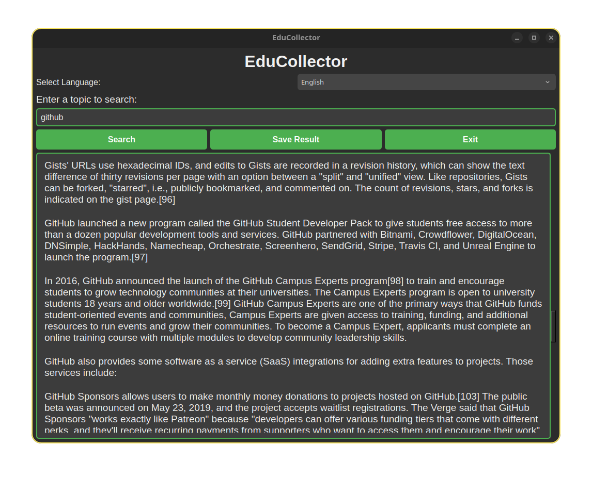

# EduCollector



EduCollector is a PyQt-based desktop application that allows users to fetch, read, and save Wikipedia content in multiple languages. It's designed to make learning easier and more accessible with a modern interface and multilingual support.

## Features
- 🌍 Multi-language support: English, Türkçe, Français, Deutsch, العربية.
- 🔍 Wikipedia content search with real-time results.
- 💾 Save results as a text file for offline reading.
- 🛡️ Content filtering to block prohibited keywords.
- ✨ Modern UI with smooth animations and responsive design.

## Installation
1. Clone the repository:
   ```bash
   git clone https://github.com/username/EduCollector.git
   cd EduCollector
