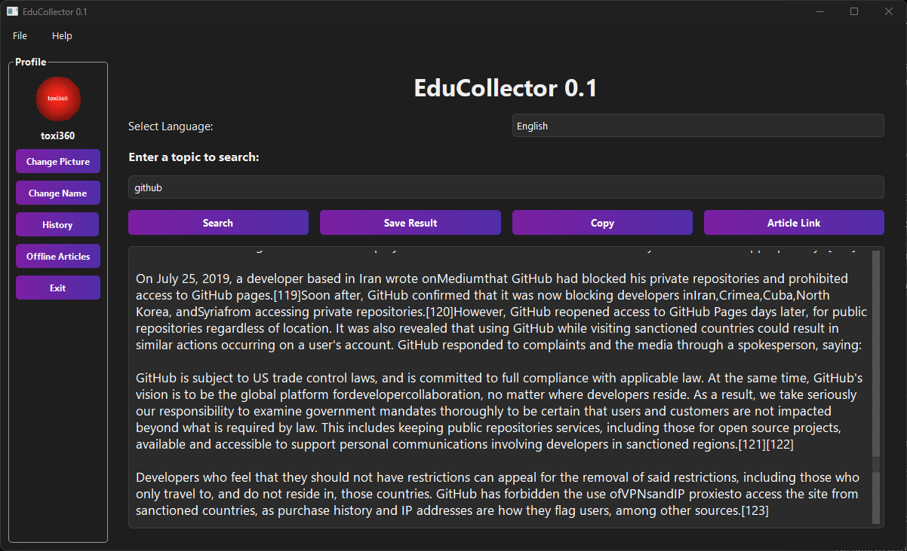

##  📚 EduCollector



**EduCollector** is a powerful and elegant desktop application built with **Python + PySide6** that allows you to **search, read, and save Wikipedia articles** in multiple languages.  
It is designed to make your research easier and your knowledge collection more organized — all in a clean and modern interface.

---

## 🚀 Features

- 🌐 **Multi-language support**  
  Search Wikipedia in **English, Türkçe, Français, Deutsch, العربية** and easily switch between languages.

- 🔍 **Wikipedia content search**  
  Instantly fetch and read Wikipedia articles directly from the app.

- 💾 **Save results**  
  Save the fetched article content to a `.txt` file for offline reading.

- 📝 **Offline articles viewer** *(New in v0.1)*  
  All your saved articles are stored locally and can be accessed anytime without an internet connection.

- 📋 **Copy to clipboard** *(New in v0.1)*  
  Copy the entire article content with one click.

- 🔗 **Open article link** *(New in v0.1)*  
  Quickly open the original Wikipedia page of the article.

- 🕒 **Search History**  
  View your past search history and re-search with a double-click.

- 👤 **User Profile System**  
  Customize your **profile picture** and **username**. Your language preference is saved automatically.

- 🔎 **Zoom in/out support**  
  Use **CTRL + Mouse Wheel** to zoom in and out on article content.

- 🌟 **Clean and Animated UI**  
  Smooth button animations and a well-structured, distraction-free interface.

- 🌙 **Dark Theme** *(New in v0.1)*  
  Modern dark theme for comfortable reading in low-light conditions.

- 💾 **Platform Independent Data Storage** *(New in v0.1)*  
  User data and articles are stored in platform-specific application data directories.

---

## 📥 Installation & Usage

### 1. Clone the repository
```bash
git clone https://github.com/Efeckc17/EduCollector.git
cd EduCollector
```

### 2. Install dependencies
```bash
pip install -r requirements.txt
```

### 3. Start the application
```bash
cd src
python main.py
```

---

## 🌟 Project Structure

```
EduCollector/
├── requirements.txt         
├── LICENSE                  
├── README.md             
└── src/
    ├── app.py              
    ├── database.py         
    ├── dialogs.py          
    ├── widgets.py          
    ├── main.py             
    ├── version.py          
    ├── licenses.py          
    └── themes/
        └── dark.qss        
```

---

## 👍 Contribution

Contributions, bug reports, and feature requests are welcome!  
You can fork this repository and submit a **Pull Request**  
or simply open an **Issue** to suggest improvements.

---

## 📩 Contact

For help or collaboration:
- **E-mail:** [toxi360@workmail.com](mailto:toxi360@workmail.com)
- **GitHub:** [@Efeckc17](https://github.com/Efeckc17)

---

## 📝 License

This project is open-source and licensed under the **GNU General Public License v3.0 (GPL-3.0)**.


